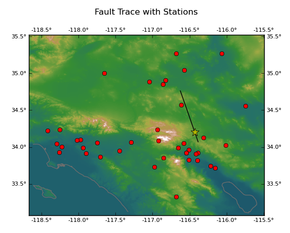
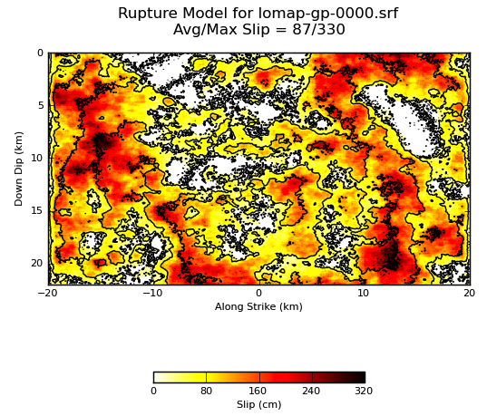

This page contains a basic description of some of the data products produced by the Broadband Platform while running a simulation. All the data products described below will be in the outdata directory after a simulation completes.

### Scenario Simulations

Scenario simulations are hypothetical simulations, what-if scenarios. Users provide a source description file describing the rupture and a station list file containing stations for which ground motions will be calculated.

#### Station Map

A map showing the fault trace along with the stations for which ground motions are calculated. The yellow star shows the hypocenter location.



#### Rupture Model



#### Velocity and Acceleration Seismograms

The Broadband Platform will produce both velocity and acceleration seismograms in BBP format for each station. An example is shown below.

```
 # Sim NGAH, stat=2001-SCE
 #    time(sec)      N-S(cm/s)      E-W(cm/s)      U-D(cm/s)
 0.000000e+00    -4.532020e-05   2.096500e-05    1.781130e-04
 2.500000e-02    -8.685250e-05   4.299330e-05    3.587300e-04
 5.000000e-02    -1.234730e-04   6.599000e-05    5.400660e-04
 7.500000e-02    -1.540990e-04   8.986040e-05    7.203370e-04
 1.000000e-01    -1.777220e-04   1.145130e-04    8.978090e-04
 ...
 ...
 1.022750e+02	9.947510e-04	2.843360e-06	-1.606000e-03
 1.023000e+02	9.947510e-04	2.843220e-06	-1.606000e-03
 1.023250e+02	9.947520e-04	2.843170e-06	-1.606000e-03
 1.023500e+02	9.947520e-04	2.843150e-06	-1.606000e-03
 1.023750e+02	9.947520e-04	2.843150e-06	-1.606000e-03
```

#### RotD50 for Each Station

A file containing the RotD50 values for 63 periods from 0.01s to 10s.

```
 #  Psa5_N Psa5_E RotD50
 #     63    0.0500
    0.0100 .45593E+00 .42564E+00 .40887E+00
    0.0110 .45659E+00 .42605E+00 .40943E+00
    0.0120 .45732E+00 .42650E+00 .41005E+00
    0.0130 .45812E+00 .42700E+00 .41074E+00
    0.0150 .45994E+00 .42813E+00 .41192E+00
 ...
 ...
    6.0000 .21332E-01 .63760E-02 .15788E-01
    6.5000 .19264E-01 .61713E-02 .14437E-01
    7.5000 .15063E-01 .50374E-02 .11496E-01
    8.5000 .11519E-01 .37930E-02 .88838E-02
   10.0000 .77129E-02 .28189E-02 .59970E-02
```

### Validation Simulations

Validation simulations can be used to calculate seismograms from historical events and compare these again recorded ground motion data, allowing scientists to develop and validate their methods. For this reason, only locations where recorded ground motions are available can be used. In addition to all data products described above for scenario simulations, the following data products will also be calculated:

#### Seismogram Comparison Plots

Plots showing calculated data (in red) along with observation data (in black). The two bottom plots show a comparison of the arias duration between simulations and recorded data.

[[/images/NR_10000000_2001-SCE_overlay.png|Seismogram Comparison]]

#### PSA Comparison Plots

[[/images/NR_10000000_2032-LBR_rotd50.png|RotD50 Comparison]]

#### Goodness-of-Fit Plot

[[/images/gof-NR-10000000_r0-120-rd50.png|GoF Plot]]

#### Map Goodness-of-Fit Plot

[[/images/gof-map-NR-10000000-rotd50.png|Map GoF Plot]]

#### Distance Goodness-of-Fit Plot

[[/images/gof-dist-log-NR-10000000-rotd50.png|Distance GoF Plot]]

#### Anderson GOF

The Anderson GOF produces plots showing results from the following 10 metrics:

Index | Metric
----- | ------
C1 | Arias Duration
C2 | Energy Duration
C3 | Arias Intensity
C4 | Energy Integral
C5 | Peak Acceleration
C6 | Peak Velocity
C7 | Peak Displacement
C8 | Response Spectra
C9 | Fourier Spectra
C10 | Cross Correlation

##### Per Station Plots

[[/images/gof-NR-10000000-anderson-2004-JGB.png|Anderson Station]]

##### Summary Plots

[[/images/gof-NR-10000000-anderson-summary.png|Anderson Summary]]

#### RotD100/RotD50 Ratio Plot

[[/images/gof-NR-10000000_r0-120-rd100.png|RotD100 Plot]]

#### RZZ2015 Plots

The Broadband Platform will generate one RZZ2015 plot per component, per station. In these plots, simulated data is presented in red while observed data is shown in black.

[[/images/10000000.rzz2015.2001-SCE.001.png|RZZ2015 Plot]]
