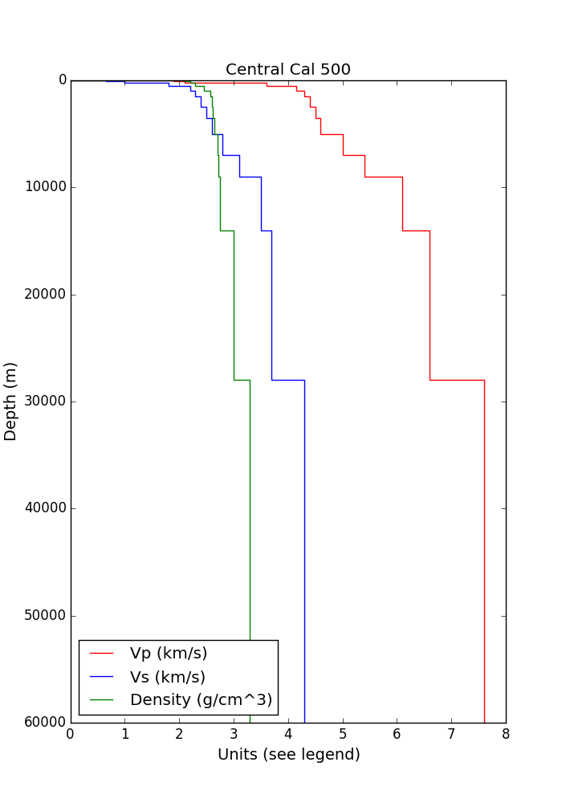

This page describes the format for the files used in Broadband Platform Simulations. The simple source description (SRC) and the station list (STL) files are inputs to Broadband Platform simulations, and must be provided for every run. The velocity model file is part of a velocity model configuration package and is also an input to the platform. A single velocity model file can be shared among several simulations using the same region. Time history (BBP) files are produced by the Platform for each station included in the station list. The Broadband Platform workflow description (XML) file is an intermediate product of the Broadband Platform. It is produced automatically by the Platform, but can also be provided by the user in cases where script automation is used to replace the interactive prompts of the Platform.

### Simple Source Description (SRC) file

Below is a sample SRC file, used to describe the 1989 Loma Prieta earthquake in Northern California:

```
#
# Loma Prieta source file
#
MAGNITUDE = 6.94
FAULT_LENGTH = 40.0
FAULT_WIDTH = 17.5
DEPTH_TO_TOP = 3.85
STRIKE = 128
RAKE = 145
DIP = 70
LAT_TOP_CENTER = 37.0789
LON_TOP_CENTER = -121.8410
HYPO_ALONG_STK = 0.0
HYPO_DOWN_DIP =  14.75
#
# Model specific parameters
#
DWID = 0.1
DLEN = 0.1
CORNER_FREQ = 0.04
CORNER_FREQ_1 = 0.04
CORNER_FREQ_2 = 1.0
#
# Alternative SEEDS create alternative .srf
#
SEED = 2379646
```

In the SRC file, lines starting with '#' are considered comments and are ignored by the Platform.
* The first few parameters are used to specify the event magnitude and describe the rupture.
* Magnitude (Mw) is the moment magnitude of the earthquake.
* FAULT_LENGTH (km) is used to specify the extent of the fault plane in the along strike direction.
* FAULT_WIDTH (km) specifies the dimension of the fault plane in the down dip direction.
* DEPTH_TO_TOP (km, positive) specifies how deep the fault plane is located (zero means a surface rupture).
* LAT_TOP_CENTER (decimal degrees) and LON_TOP_CENTER (decimal degrees) specify the location of the top center point of the fault plane.
* HYPO_ALONG_STK (km positive or negative) and HYPO_DOWN_DIP (km positive) specify the hypocenter location within the fault plane, with the (0, 0) coordinate being the TOP_CENTER of the fault plane. Therefore, HYPO_ALONG_STK goes from -(FAULT_LENGTH / 2) to (FAULT_LENGTH / 2), with zero being the mid-point of the fault plane. HYPO_DOWN_DIP starts at zero (top of the plane) and goes down to FAULT_WIDTH. All distances should be provided in kilometers (km).

##### Strike and Rake

STRIKE, RAKE, and DIP are used to describe the fault mechanism and should be provided in decimal degrees.

As per Rob Graves, strike and rake are defined using Aki & Richards format:

Stand over the fault, straddling it with one foot on each side of the fault, such that the hanging wall is on your right (under right foot) and the footwall is on the left (under left foot). Look towards the horizon, then

* strike direction is the angle between North and the direction you are looking
* slip direction is defined as the direction of motion of the hanging wall relative to the footwall
* rake is the angle between the strike direction and the slip direction measured in the plane of the footwall

If the fault has dip=90 (vertical), then simply choose one side to be the "hanging" wall and follow the same rules as above.

##### Miscellaneous parameters

In the second part of the file, where model-specific parameters are located, DWID and DLEN are used to provide the step interval (again, in kilometers) for the rupture creation. Smaller values will result in increased computation time. The SEED parameter enables randomization in the code (e.g. it allows different slip distributions to be generated). By using the same SEED parameter, users can generate reproducible results in the Broadband Platform.

##### UCSB parameters

Finally, the CORNER_FREQ parameters are only used by the UCSB method. In Broadband 22.4, users will need to set up both CORNER_FREQ_1 and CORNER_FREQ_2. Additionally, for BBP 22.4, users should set up CORNER_FREQ to match CORNER_FREQ_1. We expect to revise the UCSB pipeline and remove the need to duplicate the first value in our next Broadband Platform release. Please refer to the UCSB method documentation for more details on how to set up the two corner frequency values.

### Station List (STL) file

Below is a sample STL file, with the stations used in the 1989 Loma Prieta earthquake:

```
# BBP Station List for Loma Prieta
# Lon    Lat    StationId  Vs30(m/s)  LP_Freq(Hz)  HP_Freq(Hz)
-121.803 37.050  8001-CLS   462 0.1875  32.0000
-122.010 37.172  8002-LGP   515 0.1250  10.0000
-121.991 37.202  8003-LEX  1070 0.1000  23.9998
-122.031 37.255  8004-STG   387 0.1250  30.3998
-122.009 37.262  8005-WVC   387 0.1250  30.3998
-121.572 36.973  8006-G01  1428 0.0750  40.0000
-121.568 36.973  8007-GIL   730 0.1250  28.0002
-121.984 37.047  8008-BRN   353 0.1250  10.0000
-121.569 37.009  8009-GOF   387 0.2250  30.3998
-121.536 36.987  8010-G03   350 0.1250  26.3999
-121.803 37.210  8011-SJTE  672 0.0375  23.9998
-121.995 36.972  8012-WAH   390 0.1000  56.0004
-121.397 36.848  8013-HSP   306 0.0875  18.3999
-122.062 37.001  8014-UC2   714 0.1250  40.0000
-121.434 37.033  8015-GMR   334 0.1625  28.0002
-122.060 37.001  8016-LOB   714 0.1500  32.0000
-122.210 37.420  8017-SLC   425 0.1250  22.3999
-121.395 36.753  8018-SG3   609 0.0625  20.0000
-122.258 37.429  8019-WDS   454 0.1000  20.0000
-121.484 37.026  8020-G06   663 0.1625  24.7997
-121.628 37.166  8021-ADL   489 0.1750  25.6003
-121.628 37.166  8022-AND   489 0.1000  32.0000
-121.807 37.452  8023-CLR   540 0.0875  20.0000
-121.642 36.671  8024-SJW   353 0.1250  22.3999
-121.446 36.765  8025-SGI   748 0.1250  24.7997
-121.550 37.118  8026-CYC   540 0.1625  24.7997
-121.184 36.573  8027-BVF   353 0.3750  16.0000
-122.361 37.529  8028-XSP   782 0.1250  16.0000
-122.391 37.786  8029-RIN   873 0.1250  32.0000
-122.061 37.657  8030-A3E   517 0.1250  23.9998
-122.513 37.778  8031-CFH   782 0.1375  17.6001
-121.880 37.597  8032-SUF   401 0.1250  16.0000
-121.043 36.569  8033-BVU   390 0.2500  16.0000
-122.249 37.876  8034-BRK   609 0.1250  14.4001
-122.476 37.808  8035-GGB   653 0.1625  17.6001
-121.249 36.658  8036-BVW   331 0.1125  16.0000
-121.932 37.709  8037-DFS   353 0.1000  10.4000
-121.143 36.532  8038-BVR   304 0.1625  18.3999
-122.527 37.822  8039-PTB  1316 0.0750  16.0000
-122.308 37.512  8040-BES   628 0.1000  17.6001
```

Each line in the station list (STL) file contains information about one station used in the simulation. Lines starting with '#' are comments and are ignored by the Broadband Platform. Each line should contain at least 3 parameters, but can also optionally include a total of 4 or 6 parameters. The first 3 parameters (required) are longitude, latitude, and station name. Latitude and longitude should be provided in decimal degrees (if converting from degrees, minutes, and seconds, the latitude of 37 degrees, 30 minutes, and 0 seconds should be specified as 37.5). The station name is an identifier for the station and should contain between 3 and 10 characters. These 3 parameters form the minimum set required for each of the stations. Optionally, a station can include a 4th parameter, the Vs30 (specified in meters per second) for the particular location where the station is located. Also optionally, each station can include 2 more parameters that specify the frequency range (in Hertz) where recordings for a specific station are valid. These 2 values, used only when the platform runs in validation mode, are used to filter untrusted data out of the Goodness of Fit (GoF) plots. Please note that it is not possible to include the frequency ranges without including the Vs30 parameter. If the frequency range is not specified, the Broadband Platform will use the entire 0.1Hz to 100Hz range for the GoF plots.

### Time History (BBP) file

Below is a sample time series (BBP) file, produced by the Broadband Platform:

```
% --------------------------------------------------
% synthetic broadband seismogram (Mai&Olsen 2008)   
% N = 8 header lines
% site:  5017-A-GLP
% NPTS, DT:  10922 0.009372998029
%
% time(s)    NS (cm/s)      EW(cm/s)       UP (cm/s)
% --------------------------------------------------
  0.00000    0.00000E+00    0.00000E+00    0.00000E+00
  0.00937    0.00000E+00    0.00000E+00    0.00000E+00
  0.01875    0.00000E+00    0.00000E+00    0.00000E+00
  0.02812    0.00000E+00    0.00000E+00    0.00000E+00
  0.03749    0.00000E+00    0.00000E+00    0.00000E+00
…
  4.82709    0.13824E-01   -0.44237E-02   -0.41983E-02
  4.83647    0.64276E-01   -0.24146E-01   -0.31487E-01
  4.84584    0.10083E+00   -0.45090E-01   -0.74688E-01
  4.85521    0.93571E-01   -0.50971E-01   -0.10271E+00
  4.86459    0.74907E-01   -0.51622E-01   -0.12331E+00
  4.87396    0.55531E-01   -0.51775E-01   -0.14432E+00
…
102.32502    0.11583E+00    0.26702E-01    0.93545E-01
102.33439    0.11322E+00    0.26290E-01    0.92550E-01
102.34377    0.11017E+00    0.25777E-01    0.91201E-01
102.35314    0.10671E+00    0.25165E-01    0.89504E-01
102.36251    0.10283E+00    0.24455E-01    0.87463E-01
```

In the BBP file, lines beginning with a '%' or '#' are considered comments and should be ignored. The comment section at the top of the file contains useful information about the BBP file. For example, it includes the station name corresponding to the data, as well as the number of points in the file and the DT used in the simulation.

The rest of the file is organized in 4 columns containing the actual time series data. As indicated in the file's header, the first column corresponds to the timestamp (in seconds), and the last 3 columns correspond to the 3 components - 2 horizontals (north/south and east/west), and 1 vertical (up/down). For a velocity time history, the units indicated at the top of the file will be cm/s and for an acceleration time history, they will be cm/s/s. Each line in the file corresponds to a data point, spaced DT seconds apart from the next point.

### Velocity Model File

In the Broadband Platform, 1D velocity model files are part of a velocity model package in the Platform, and are generally tied to a region. All Broadband Platform simulations using that specific region will share the same velocity model file.

In the velocity model file, the first line indicates how many layers compose the velocity model. The following lines, one for each layer, describes the layer in details. The first column is the thickness of the layer (in kilometers). The second and third columns are Vp and Vs, respectively, both in km/s. The forth column contains the rho value (in g/cm3), while the last two columns contain the Qp and Qs parameters respectively.

Currently available 1D velocity models are:

#### LA Basin

```
15
  0.010000   1.500000   0.425000   2.000000      42.50      21.25
  0.020000   1.600000   0.538000   2.050000      53.80      26.90
  0.070000   1.800000   0.650000   2.100000      65.00      32.50
  0.100000   2.000000   0.800000   2.200000      80.00      40.00
  0.300000   3.100000   1.400000   2.300000     140.00      70.00
  0.500000   3.700000   1.800000   2.450000     180.00      90.00
  0.500000   4.200000   2.100000   2.575000     210.00     105.00
  1.000000   4.750000   2.400000   2.600000     240.00     120.00
  1.000000   5.100000   2.750000   2.620000     275.00     137.50
  1.500000   5.400000   3.000000   2.650000     300.00     150.00
  2.000000   5.800000   3.350000   2.700000     335.00     167.50
  2.000000   6.200000   3.500000   2.720000     350.00     175.00
  8.000000   6.350000   3.600000   2.750000     360.00     180.00
 13.000000   6.800000   3.800000   3.000000     380.00     190.00
999.000000   7.800000   4.500000   3.300000     450.00     225.00
```


#### Mojave

```
16
  0.010000   1.600000   0.425000   2.000000      42.50      21.25
  0.020000   1.700000   0.550000   2.050000      55.00      27.50
  0.070000   1.900000   0.650000   2.100000      65.00      32.50
  0.100000   2.300000   0.900000   2.200000      90.00      45.00
  0.300000   2.900000   1.400000   2.300000     140.00      70.00
  0.500000   3.700000   1.900000   2.450000     190.00      95.00
  0.500000   4.500000   2.300000   2.575000     230.00     115.00
  0.500000   4.900000   2.800000   2.600000     280.00     140.00
  1.000000   5.300000   3.000000   2.650000     300.00     150.00
  1.000000   5.600000   3.200000   2.700000     320.00     160.00
  1.000000   5.800000   3.300000   2.750000     330.00     165.00
  1.000000   6.100000   3.500000   2.800000     350.00     175.00
 10.000000   6.320000   3.650000   2.850000     365.00     182.50
  5.000000   6.550000   3.700000   2.900000     370.00     185.00
 10.000000   6.800000   3.800000   2.950000     380.00     190.00
999.000000   7.800000   4.500000   3.200000     450.00     225.00
```


#### Northern California

```
15
  0.010000   1.600000   0.425000   2.000000      42.50      21.25
  0.020000   1.700000   0.538000   2.050000      53.80      26.90
  0.070000   1.900000   0.650000   2.100000      65.00      32.50
  0.100000   2.100000   0.800000   2.200000      80.00      40.00
  0.300000   2.500000   1.200000   2.300000     120.00      60.00
  0.500000   3.600000   1.900000   2.450000     190.00      95.00
  0.500000   4.400000   2.500000   2.575000     250.00     125.00
  1.000000   4.800000   2.800000   2.600000     280.00     140.00
  1.000000   5.250000   3.100000   2.620000     310.00     155.00
  1.500000   5.500000   3.250000   2.650000     325.00     162.50
  2.000000   5.600000   3.350000   2.700000     335.00     167.50
  2.000000   5.750000   3.450000   2.720000     345.00     172.50
  8.000000   6.100000   3.600000   2.750000     360.00     180.00
  8.000000   6.500000   3.800000   3.000000     380.00     190.00
999.000000   7.800000   4.400000   3.300000     440.00     220.00
```


#### Central California

```
15
  0.010000   1.600000   0.425000   2.000000      42.50      21.25
  0.020000   1.700000   0.538000   2.050000      53.80      26.90
  0.070000   1.900000   0.650000   2.100000      65.00      32.50
  0.100000   2.100000   1.000000   2.200000     100.00      50.00
  0.300000   3.600000   1.800000   2.300000     180.00      90.00
  0.500000   4.150000   2.200000   2.450000     220.00     110.00
  0.500000   4.300000   2.300000   2.575000     230.00     115.00
  1.000000   4.400000   2.400000   2.600000     240.00     120.00
  1.000000   4.500000   2.500000   2.620000     250.00     125.00
  1.500000   4.600000   2.600000   2.650000     260.00     130.00
  2.000000   5.000000   2.800000   2.700000     280.00     140.00
  2.000000   5.400000   3.100000   2.720000     310.00     155.00
  5.000000   6.100000   3.500000   2.750000     350.00     175.00
 14.000000   6.600000   3.700000   3.000000     370.00     185.00
999.000000   7.600000   4.300000   3.300000     430.00     215.00
```



#### Eastern United States

```
23
     0.0307     1.7300     1.0000     2.0306      10.00      10.00
     0.0140     2.6832     1.5510     2.1408      35.51      35.51
     0.0553     3.1192     1.8030     2.2766      38.03      38.03
     1.8330     5.1900     3.0000     2.6111     500.00     500.00
     0.8950     5.5770     3.2240     2.6650     500.00     500.00
     2.1720     5.8280     3.3690     2.7000    1500.00    1500.00
     2.1500     6.1760     3.5700     2.7568    2900.00    2900.00
     7.5000     6.1800     3.5700     2.7248    2900.00    2900.00
    11.0000     6.3600     3.6800     2.7811    2900.00    2900.00
     8.0000     7.1200     4.1200     3.0660    2900.00    2900.00
     1.0000     7.1500     4.1300     3.0520    2900.00    2900.00
     1.2000     7.2600     4.2000     3.0943    2900.00    2900.00
     0.8500     7.6400     4.4200     3.2331    2900.00    2900.00
     0.2000     7.9700     4.6100     3.3533    2900.00    2900.00
    10.0000     8.1200     4.6900     3.4059    2900.00    2900.00
    10.0000     8.3500     4.7000     3.4489    2900.00    2900.00
    10.0000     8.4000     4.7600     3.4775    2900.00    2900.00
    10.0000     8.4100     4.7800     3.4859    2900.00    2900.00
    10.0000     8.4200     4.7900     3.4909    2900.00    2900.00
    10.0000     8.4200     4.8100     3.4976    2900.00    2900.00
    10.0000     8.4200     4.8300     3.5043    2900.00    2900.00
    10.0000     8.4200     4.8500     3.5109    2900.00    2900.00
   999.0000     8.4300     4.8700     3.5193    2900.00    2900.00
```


#### Eastern Canada

```
24
     0.0307     1.7300     1.0000     2.0306      10.00      10.00
     0.0140     2.6832     1.5510     2.1408      35.51      35.51
     0.0553     3.1192     1.8030     2.2766      38.03      38.03
     1.8330     5.1900     3.0000     2.6111     500.00     500.00
     0.8950     5.5770     3.2240     2.6650     500.00     500.00
     2.1720     5.8280     3.3690     2.7000    1500.00    1500.00
     1.5000     6.1760     3.5700     2.7568    2900.00    2900.00
     7.9000     6.5000     3.7600     2.8512    2900.00    2900.00
     7.6000     6.6500     3.8400     2.8901    2900.00    2900.00
     7.8000     6.9700     4.0300     3.0057    2900.00    2900.00
     8.2500     7.1200     4.1200     3.0644    2900.00    2900.00
     1.0000     7.1500     4.1300     3.0520    2900.00    2900.00
     1.2000     7.2600     4.2000     3.0943    2900.00    2900.00
     0.8500     7.6400     4.4200     3.2331    2900.00    2900.00
     0.2000     7.9700     4.6100     3.3533    2900.00    2900.00
    10.0000     8.1200     4.6900     3.4059    2900.00    2900.00
    10.0000     8.3500     4.7000     3.4489    2900.00    2900.00
    10.0000     8.4000     4.7600     3.4775    2900.00    2900.00
    10.0000     8.4100     4.7800     3.4859    2900.00    2900.00
    10.0000     8.4200     4.7900     3.4909    2900.00    2900.00
    10.0000     8.4200     4.8100     3.4976    2900.00    2900.00
    10.0000     8.4200     4.8300     3.5043    2900.00    2900.00
    10.0000     8.4200     4.8500     3.5109    2900.00    2900.00
   999.0000     8.4300     4.8700     3.5193    2900.00    2900.00
```


#### Central Japan

```
11
  0.010000   1.600000   0.425000   2.000000      42.50      21.25
  0.020000   1.700000   0.550000   2.050000      55.00      27.50
  0.070000   1.900000   0.650000   2.100000      65.00      32.50
  0.100000   2.400000   1.000000   2.200000     100.00      50.00
  0.160000   3.000000   1.400000   2.450000     140.00      70.00
  0.100000   3.600000   2.000000   2.550000     200.00     100.00
  0.440000   4.200000   2.400000   2.600000     240.00     120.00
  5.900000   5.500000   3.200000   2.650000     320.00     160.00
 10.200000   6.100000   3.400000   2.750000     340.00     170.00
 14.630000   6.500000   3.800000   3.000000     380.00     190.00
999.000000   7.800000   4.500000   3.300000     450.00     225.00
```


#### Western Japan

```
9
  0.010000   1.600000   0.425000   2.000000      42.50      21.25
  0.020000   1.700000   0.550000   2.100000      55.00      27.50
  0.030000   2.400000   1.200000   2.200000     120.00      60.00
  0.030000   2.800000   1.600000   2.450000     160.00      80.00
  0.040000   4.200000   2.400000   2.600000     240.00     120.00
  6.670000   5.500000   3.200000   2.650000     320.00     160.00
 10.200000   6.100000   3.400000   2.750000     340.00     170.00
 14.630000   6.500000   3.800000   3.000000     380.00     190.00
999.000000   7.800000   4.500000   3.300000     450.00     225.00
```


### Broadband Platform Workflow Description (XML) File

The Broadband Platform uses a XML file to describe the workflow, or processing sequence, required to produce all simulation results. In the workflow description, the <BBP_Modules> section includes a list of all modules that need to run, in the required sequence, with the necessary parameters. For each module, the file contains a <BBP_Module> element, that names the module, includes the files needed to be copied to the indata directory before the module is executed, and the arguments needed for the module to produce the required results. File paths can be absolute paths, or can be referenced to one of Broadband's environmental variables. For example, "BBP_INSTALL_VAL" and "BBP_INSTALL_GF" will refer to the base directories where validation packages and velocity model packages are installed. A workflow description file is produced automatically by the Platform as the user walks through the interactive prompt. It is written to the xml directory before the simulation starts.

```
<BBP_Run_Specification>
	<Validation_Run event="WHITTIER" input_station_file="$BBP_INSTALL_VAL/Whittier/common/whittier_v19_02_1.stl" version="19.4.0"/>
	<BBP_Modules>
		<BBP_Module>
			<name>Genslip</name>
			<staged_files>
				<file>$BBP_INSTALL_GF/LABasin500/gp/nr02-vs500.fk1d</file>
				<file>$BBP_INSTALL_VAL/Whittier/sdsu/whittier_v12_11_0_sdsu.src</file>
			</staged_files>
			<arguments>
				<argument type="str">nr02-vs500.fk1d</argument>
				<argument type="str">whittier_v12_11_0_sdsu.src</argument>
				<argument type="str">whittier_v12_11_0_sdsu.srf</argument>
				<argument type="str">LABasin500</argument>
			</arguments>
		</BBP_Module>
		<BBP_Module>
			<name>Jbsim</name>
			<staged_files>
				<file>$BBP_INSTALL_GF/LABasin500/gp/nr02-vs500.fk1d</file>
				<file>$BBP_INSTALL_VAL/Whittier/sdsu/whittier_v12_11_0_sdsu.src</file>
				<file>$BBP_INSTALL_VAL/Whittier/common/whittier_v19_02_1.stl</file>
			</staged_files>
			<arguments>
				<argument type="str">nr02-vs500.fk1d</argument>
				<argument type="str">whittier_v12_11_0_sdsu.src</argument>
				<argument type="str">whittier_v12_11_0_sdsu.srf</argument>
				<argument type="str">whittier_v19_02_1.stl</argument>
				<argument type="str">LABasin500</argument>
			</arguments>
		</BBP_Module>
		<BBP_Module>
			<name>BBToolbox</name>
			<staged_files>
				<file>$BBP_INSTALL_GF/LABasin500/sdsu/sdsu-aug2018-labasin-vmod.txt</file>
				<file>$BBP_INSTALL_VAL/Whittier/sdsu/whittier_v12_11_0_sdsu.src</file>
				<file>$BBP_INSTALL_VAL/Whittier/common/whittier_v19_02_1.stl</file>
			</staged_files>
			<arguments>
				<argument type="str"></argument>
				<argument type="str">sdsu-aug2018-labasin-vmod.txt</argument>
				<argument type="str">whittier_v12_11_0_sdsu.src</argument>
				<argument type="str">whittier_v12_11_0_sdsu.srf</argument>
				<argument type="str">whittier_v19_02_1.stl</argument>
				<argument type="str">LABasin500</argument>
			</arguments>
		</BBP_Module>
		<BBP_Module>
			<name>WccSiteamp</name>
			<staged_files>
				<file>$BBP_INSTALL_VAL/Whittier/common/whittier_v19_02_1.stl</file>
			</staged_files>
			<arguments>
				<argument type="str">whittier_v19_02_1.stl</argument>
				<argument type="str">SDSU</argument>
				<argument type="str">LABasin500</argument>
			</arguments>
		</BBP_Module>
		<BBP_Module>
			<name>Plot_Map</name>
			<staged_files>
				<file>$BBP_INSTALL_VAL/Whittier/sdsu/whittier_v12_11_0_sdsu.src</file>
				<file>$BBP_INSTALL_VAL/Whittier/common/whittier_v19_02_1.stl</file>
			</staged_files>
			<arguments>
				<argument type="str">whittier_v12_11_0_sdsu.src</argument>
				<argument type="str">whittier_v19_02_1.stl</argument>
			</arguments>
		</BBP_Module>
		<BBP_Module>
			<name>PlotSeis</name>
			<staged_files>
				<file>$BBP_INSTALL_VAL/Whittier/common/whittier_v19_02_1.stl</file>
				<file>$BBP_INSTALL_VAL/Whittier/sdsu/whittier_v12_11_0_sdsu.src</file>
			</staged_files>
			<arguments>
				<argument type="str">whittier_v19_02_1.stl</argument>
				<argument type="str">whittier_v12_11_0_sdsu.src</argument>
				<argument type="bool">True</argument>
				<argument type="bool">True</argument>
			</arguments>
		</BBP_Module>
		<BBP_Module>
			<name>RotD100</name>
			<staged_files>
				<file>$BBP_INSTALL_VAL/Whittier/common/whittier_v19_02_1.stl</file>
			</staged_files>
			<arguments>
				<argument type="str">whittier_v19_02_1.stl</argument>
			</arguments>
		</BBP_Module>
		<BBP_Module>
			<name>ObsSeismograms</name>
			<staged_files>
				<file>$BBP_INSTALL_VAL/Whittier/common/whittier_v19_02_1.stl</file>
			</staged_files>
			<arguments>
				<argument type="str">whittier_v19_02_1.stl</argument>
				<argument type="str">$BBP_INSTALL_VAL/Whittier/obs/Acc</argument>
				<argument type="str">acc_peer</argument>
				<argument type="str"></argument>
			</arguments>
		</BBP_Module>
		<BBP_Module>
			<name>GenPlots</name>
			<staged_files>
				<file>$BBP_INSTALL_VAL/Whittier/common/whittier_v19_02_1.stl</file>
			</staged_files>
			<arguments>
				<argument type="str">whittier_v19_02_1.stl</argument>
				<argument type="str">acc</argument>
				<argument type="str">WHITTIER</argument>
			</arguments>
		</BBP_Module>
		<BBP_Module>
			<name>GPGof</name>
			<staged_files>
				<file>$BBP_INSTALL_VAL/Whittier/sdsu/whittier_v12_11_0_sdsu.src</file>
				<file>$BBP_INSTALL_VAL/Whittier/common/whittier_v19_02_1.stl</file>
			</staged_files>
			<arguments>
				<argument type="str">whittier_v12_11_0_sdsu.src</argument>
				<argument type="str">whittier_v19_02_1.stl</argument>
				<argument type="str">WHITTIER</argument>
				<argument type="int">100</argument>
			</arguments>
			<keyword_arguments>
				<keyword_argument keyword="single_component" type="bool">False</keyword_argument>
			</keyword_arguments>
		</BBP_Module>
		<BBP_Module>
			<name>GenHTML</name>
			<staged_files>
				<file>$BBP_INSTALL_VAL/Whittier/common/whittier_v19_02_1.stl</file>
				<file>$BBP_INSTALL_VAL/Whittier/sdsu/whittier_v12_11_0_sdsu.src</file>
			</staged_files>
			<arguments>
				<argument type="str">whittier_v19_02_1.stl</argument>
				<argument type="str">whittier_v12_11_0_sdsu.src</argument>
				<argument type="str">LABasin500</argument>
				<argument type="str">WHITTIER</argument>
				<argument type="str">SDSU</argument>
			</arguments>
		</BBP_Module>
	</BBP_Modules>
</BBP_Run_Specification>
```

### Option File

Option files contain responses to the prompts in the platform. You can use them with the -o option to run_bbp.py. The responses have to match the prompts exactly. For example, if you craft an option file assuming a certain order of station lists (stl) or source descriptions (src) files in the run directory and there is a different set of files there it will potentially cause the Broadband Platform to pick a wrong file or possibly abort. Whenever a list of method, files, velocity models, or validation events is presented, the user can use either name or number to select that option. Picking the name avoids problems with the ordering. Option files are recommended to perform a series of runs with different inputs or different modules. If you have a run you perform regularly, it's better practice to run the platform with the -g option and the option file to produce an XML description, which are more complete descriptions of the workflow.

```
 #optional comments
 %using either symbol
 n #comments
 y % can go
 1 # here
 LABasin # velocity model
 ...
```

Use with:

```
 $ ./run_bbp.py -o <option file>
```
