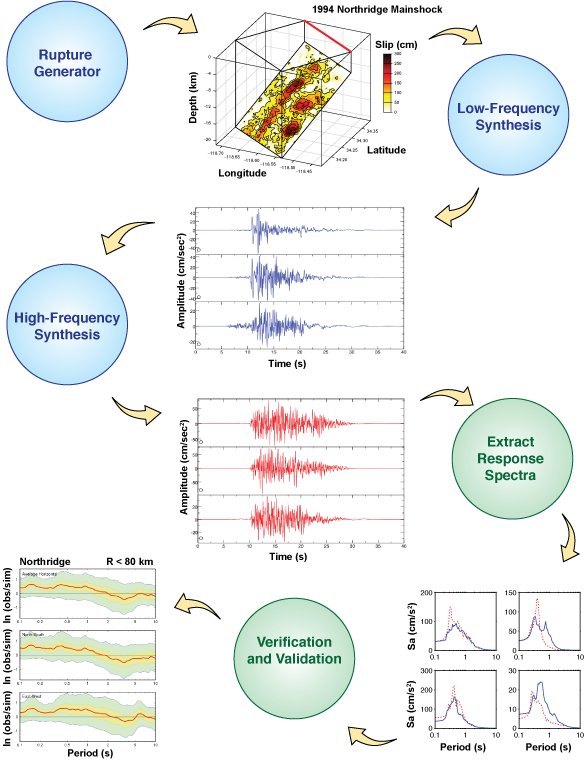

The Southern California Earthquake Center (SCEC) Broadband Platform (BBP) is a software system that can generate 0-20+ Hz seismograms for historical and scenario earthquakes in California, Eastern North America, and Japan using several alternative computational methods.

## Latest Release
The most recent version of the SCEC Broadband Platform is version 22.4 which was released in August 2022. The BBP 22.4 software can be downloaded from:

* [Broadband Platform GitHub repository](https://github.com/SCECcode/bbp) (Released August 2022)
* [Broadband Platform Github Wiki Documentation](https://github.com/SCECcode/bbp/wiki)

We recommend that all new users work with BBP 22.4 because the version adds new capabilities and provides improvements to the methods provided in earlier releases of the Broadband Platform. Existing BBP users should review the [Broadband Platform 22.4 release notes](./Release-Notes) and should upgrade to this new version if the improvements included in it are important to their specific use of the platform. Previous versions of the Broadband Platform are available for users that want to reproduce results produced with earlier versions of the Platform. Please review the [BBP installation instructions](./Installation) for details on how to download and install the BBP 22.4 on your local computer.

## Overview
The goal of the SCEC Broadband Simulation Platform is to generate broadband (0-20+ Hz) ground motions for earthquakes. The SCEC Broadband Platform is a collaborative software development project involving SCEC researchers, research engineers, graduate students, and the SCEC/CME software development group. SCEC scientific groups have contributed modules to the Broadband Platform including kinematic rupture generation, low- and high-frequency seismogram synthesis using 3D wave propagation through 1D layered velocity structures, non-linear site effects, ground motion intensity measure calculations, and visualization. These complex scientific codes have been integrated into a system that supports easy on-demand computation of broadband seismograms, providing user-defined, repeatable calculation of ground-motion seismograms, using alternative simulation methods, and software utilities to generate tables, plots, and maps. The SCEC Broadband Platform is designed to be used by both scientific and engineering researchers with some experience interpreting ground motion simulations.

Users may calculate broadband seismograms for both historical earthquakes (validation events including Northridge, Loma Prieta, etc.) and user-defined earthquakes. The platform produces a variety of data products, including broadband seismograms, rupture visualizations, and several goodness-of-fit plots. When running a validation event, users supply their own simple source description, or provide a rupture description in SRF format. Users may specify their own list of stations or use a provided list.

The SCEC BBP software can be compiled and run on recent Linux systems with GNU compilers. The Broadband Platform continues to evolve, and new versions of the BBP are released periodically on GitHub. The latest release includes seven simulation methods, eight simulation regions covering California, Japan, Eastern North America, and the ability to compare simulation results against empirical ground motion models. The newest features include the ability to simulate multi-segment ruptures using several simulation methods. And, in addition to a new simulation method, it now includes improvements to several existing ground motion simulation methods and revised Green’s functions for all simulation regions. In this release, the site response module is integrated with all simulation methods and can also be used for comparing simulated data against historical earthquakes

The SCEC-developed portions of the Broadband platform software is distributed under the terms of the BSD 3-Clause open-source license. Please see the LICENSE.txt file for more information. Individual models codes may be offered under their own open-source software licenses, please look for a LICENSE.txt file under specific sub folders in the 'src' directory for module-specific license information.

### Preferred Reference for the Broadband Platform Software
Please support the Broadband Platform project by acknowledging the use of this software. Acknowledgements and citations help us obtain additional resources for continued development of the platform. The primary reference for the Broadband Platform software system (v15.3.0 and later) is:

* Maechling, P. J., F. Silva, S. Callaghan, and T. H. Jordan (2015). SCEC Broadband Platform: System Architecture and Software Implementation, Seismol. Res. Lett., 86, no. 1, doi: 10.1785/0220140125.

Additional information describing how to cite specific methods implemented in the Broadband Platform is provided in more detail on the [acknowledgement page](./Acknowledging)

### Broadband Platform Diagram

