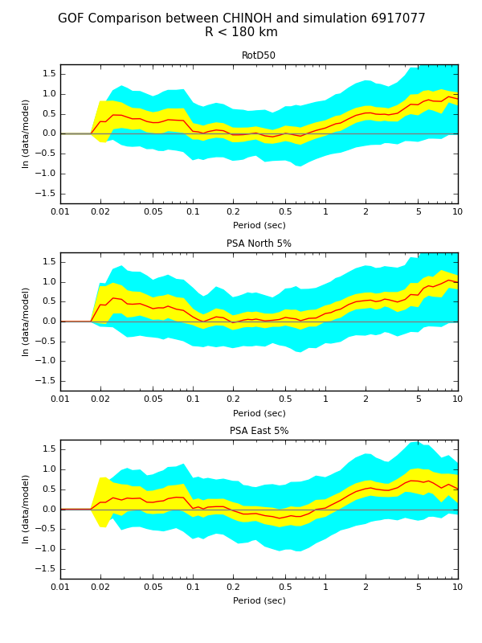
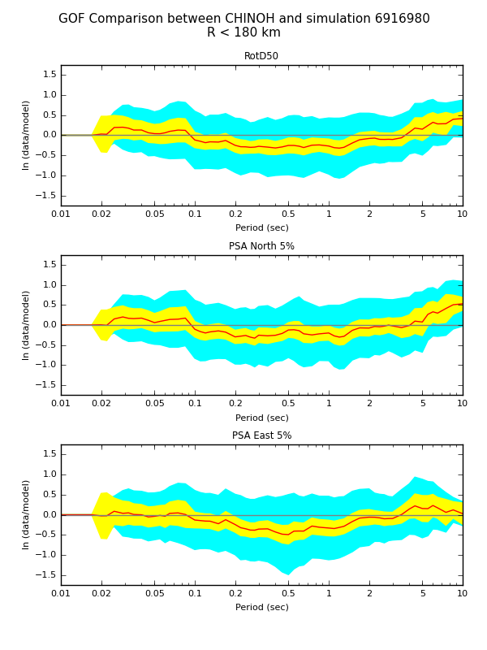

The platform supports two kinds of simulations, validation events and user-defined events. Validation simulations are performed using a historical event, and are directly compared to observed seismograms using goodness-of-fit. User-defined events are run using a rupture description provided by the user which may not necessarily be a historical earthquake.

When you run a simulation, the platform assigns an ID to it. This ID can be used to track the simulation and locate the output data products.

To supply input files to the platform, put them in the 'run' directory. This directory is located in the $BBP_DATA_DIR directory and it is created by the platform when it is first ran. Extensions are important - the platform recognizes station lists (.stl), SRF files (.srf), and simple source descriptions (.src). For example, when selecting a station file, the Broadband Platform will list all the .stl files in the run directory and will prompt the user to select one.

### Platform Modes

The platform can be run in multiple modes. The default is interactive mode, in which the user is prompted to answer a series of questions. Once all the information has been gathered, the simulation run begins.

For a large number of runs, or if the user is repeating a specific run, this can be tedious. The platform provides two other ways to describe a run, with an option file or an XML description.

An option file provides responses to all the questions that the platform poses. The format is described in [File Formats](./File-Format-Guide), but it's basically a text file, 1 entry per line, with support for comments. It can be fed to the platform using the -o option.

The platform will also accept XML files containing a full description of a run. The schema for these files is given in [File Formats](./File-Format-Guide.md). These files are also produced by the platform after every simulation, and placed in xml/<simulation ID>.xml. So if you want to rerun a simulation, you can point the platform to the XML file from that simulation using the '-x' option. Note that a new simulation ID will be assigned to the run, so there is no risk of overwriting previous simulation results.

### Available Options

To get a list of the current available options, run run_bbp.py with the -h flag.

```
 $ ./run_bbp.py --help
 Usage: run_bbp.py [options]

 Options:
  -h, --help                                show this help message and exit
  -x XML_FILE, --xml-file=XML_FILE          Run using XML description of workflow
  -s SIM_ID, --sim-id=SIM_ID                Force a sim id
  -o OPTFILE, --option-file=OPTFILE         File containing responses to interactive platform prompts
  -v, --version                             Broadband platform version
  -g, --generate-only                       Generates the XML description but does not run the platform
  -l LOG_FILE, --log=LOG_FILE               Directs output to a file, use to run BBP in background
  -m, --no-xml                              Do not generate xml
  -r RESUME_MODULE, --resume=RESUME_MODULE  Resume workflow from a certain module
  -e END_MODULE, --end=END_MODULE           End workflow after a certain module
  --expert                                  Turns on expert mode
```

### Validation Simulations

To run a validation simulation, go to the data/run directory and run run_bbp.py. The platform will ask you a series of questions. Answer 'y' to "Do you want to perform a validation run?" (the exact list of validation events users see when running the Broadband Platform depends on what validation events are installed on their computers):

```
 $ run_bbp.py
 Welcome to the SCEC Broadband Platform version 19.4.0.
 ================================================================================

 Please select the Broadband Platform mode of operation:
    * Validation - Simulates a historical event
    * Scenario   - Runs a user-defined hypothetical event

 Do you want to perform a validation simulation (y/n)? y
 ================================================================================

 Please select a validation event from the list below:

 (1) Alum Rock
 (2) Chino Hills
 (3) LOMAP
 (4) NR
 (5) Whittier
 ?
 ...
```

No input files are required by the user. However, you may wish to customize the validation simulation by selecting an alternate source description (src file) or a reduced station list to speed up the computations. You can put your own source description and/or station list into the run directory (the format is described in [File Formats](./File-Format-Guide.md)) or you can tell the platform where each file is located by using an absolute path. Note that any stations which do not have observed seismograms will not be included in the automatically generated goodness-of-fit comparison. To supply alternative source description and/or station list files, please run the Broadband Platform in 'expert' mode using the '--expert' command-line flag.

### User-defined Simulations

To run a user-defined simulation, two input files are required, a source description (src file) and a station list (stl file). A simple source description (src file) is always required, but, for certain methods, a source description in SRF format (the format is described in [File Formats](./File-Format-Guide.md) can be supplied as well and will be used for the seismogram computation modules in the Broadband Platform. To run a user-defined simulation, run run_bbp.py:

```
 $ run_bbp.py
 Welcome to the SCEC Broadband Platform version 19.4.0.
 ================================================================================

 Please select the Broadband Platform mode of operation:
    * Validation - Simulates a historical event
    * Scenario   - Runs a user-defined hypothetical event

 Do you want to perform a validation simulation (y/n)? n
 ================================================================================

 The Broadband Platform provides the following velocity models, which also include
 several method-specific and region-specific parameters.

 Please select a velocity model (either number or name is ok):

 (1) CentralJapan500
 (2) CentralCal500
 (3) NOCAL500
 (4) LABasin500
 (5) WesternJapan500
 (6) Mojave500
 ?
 ...
```

You may then choose the method you would like to run:

```
 The Broadband Platform includes several scientific methods that can be
 used to calculate synthetic seismograms.

 Choose a Method to use in this Broadband scenario simulation:
 (1) GP (Graves & Pitarka)
 (2) UCSB
 (3) SDSU
 (4) EXSIM
 (5) Song
 (6) Irikura Recipe Method 1 (Irikura1)
 (7) Irikura Recipe Method 2 (Irikura2)
 ?
```

### Logging

During the run, log files will be produced in `logs/<simulation ID>/<simulation ID>.<module name>.log`.  If the platform fails, this is a good place to look to determine the error. Additionally, any fatal errors will be recorded in fatal_error.log. This information can be useful if troubleshooting an issue.

### Data Products

The platform produces a variety of data products. All data products are located in `outdata/<simulation ID>`. The ouput folder has a `index-<simulation ID>.html` file with a listing of all the data products in the output folder. You can open the index file on your browser window and then click through all data products. Image files can be displayed by clicking on the link to the file in the index.html page. The .bbp and .list files will be displayed as text files in the browser. On Mac OS X, you can see these data products by opening the outdata folder in Finder and double clicking on the specific file. On most Linux systems, you can show images using display:

```
 $ display <PNG file>
```

Make sure you have X11 forwarding enabled.

#### Station Map

To help visualize the stations in relationship to the fault, the platform produces a PNG file displaying station locations with red circles and the fault plane with a black line. You can find this file in `outdata/<simulation ID>/station_map.png`.

#### Seismograms

When running the Broadband Platform, you have the option to generate plots of velocity and acceleration seismograms for each station. Plots of these files can be found in `outdata/<simulation ID>/<simulation ID>.<station>_<velocity or acceleration>_seis.png`.

The raw seismogram data is available in `outdata/<simulation ID>/<simulation ID>.<station>.vel.bbp` (velocity) and `outdata/<simulation ID>.<station>.acc.bbp` (acceleration).  Its format is described in [File Formats](./File-Format-Guide.md).

#### Response Spectra

The RotD50 code, run during each simulation, calculates the response spectra for each station. The raw RotD50 data is located at

```
 outdata/<simulation ID>/<simulation ID>.<station>.rd50
```

in the format described in [File Formats](./File-Format-Guide.md).

#### Goodness-of-fit

If you run a goodness-of-fit module, several additional data products are produced. Two goodness-of-fit modules are available in Broadband.

* GP Goodness-of-fit: The goodness-of-fit comparison is performed by comparing the response spectra of a set of calculated seismograms to seismograms from another simulation or observed seismograms. For each station involved in the comparison, a plot comparing the response spectra calculated by the RotD50 module can be found in `outdata/<simulation ID>/<comparison label>_<simulation ID>/<station>rotd50.png`. A plot showing the seismograms on top and bottom can be found at `outdata/<comparison label>_<simulation ID>_<station>_overlay.png`. The seismogram comparison plot also includes a comparison of the arias duration. Finally, a goodness-of-fit plot with data from RotD50 is generated. It can can be found at `gof-<comparison label>-<simulation ID>_r0-<cutoff distance>-rotd50.png`.

   Note that at least 3 stations must be run for goodness-of-fit to be valid. If fewer than 3 stations are run, no goodness of fit calculation will be performed.

* SDSU Goodness-of-fit: The SDSU goodness-of-fit module can compute several GoF measures. The goodness-of-fit comparison is performed by comparing the synthetic seismogram to the observed seismogram for each of the sites. For each GoF measure computed, a summary file labeled `GOF_<measure>.list` is generated with the GoF values for each of the sites. A weighted sum of GoF measures called site-fit is available in gof_summary.txt file. If the simulation was run with three or more sites in the station list, GoF map plots will be available in the output directory as `<simulation ID>_<Gof measure>_map.png`. If PGA or PGV GoF values are computed a set of overlay plots showing the observed and synthetic seismograms on top and bottom will be available as `outdata/gof_plots/<simulation ID>_<station>_match_<format>_overlay.png` files.

#### Rupture files

When a user-defined event is simulated, the user has the option to run a rupture generator. This generator produces an SRF file, found in `outdata/<simulation ID>/*.srf`.  This file can be put in the run directory and used in future runs.  Additionally, the platform produces a plot of the cumulative slip on the fault surface, `outdata/<simulation ID>/<SRF prefix>.png`.

### Examples

Below are some examples that you can try using the sample files in the examples directory. You will need to have the Northridge (NR) Validation Package installed to use the first two examples and the Chino Hills Validation Package for the third example. All examples also require the installation of the LABasin Green's Functions package in the Broadband Platform. Finally, please make sure all the tests pass before you try these examples.

#### Running a Northridge Full Validation Simulation

You don't need to move any files for this example. Notice that we will be using the ExSIM method, which will generate results quickly.

```
 $ run_bbp.py
 Welcome to the SCEC Broadband Platform version 19.4.0
 ================================================================================

 Please select the Broadband Platform mode of operation:
    * Validation - Simulates a historical event
    * Scenario   - Runs a user-defined hypothetical event

 Do you want to perform a validation simulation (y/n)? y
 ================================================================================

 Please select a validation event from the list below:

 (1) Alum Rock
 (2) Chino Hills
 (3) LOMAP
 (4) NR
 (5) Whittier
 ? 4
 ================================================================================

 The Broadband Platform includes several scientific methods that can be
 used to calculate synthetic seismograms.

 Choose a Method to use in this Broadband validation simulation:
 (1) GP (Graves & Pitarka)
 (2) UCSB
 (3) SDSU
 (4) EXSIM
 (5) Song
 (6) Irikura Recipe Method 1 (Irikura1)
 (7) Irikura Recipe Method 2 (Irikura2)
 ? 4
 ================================================================================
 SRC file: /home/sarah/bbp/bbp_val/Northridge/common/nr_v14_02_1.src
 ================================================================================
 STL file: /home/sarah/bbp/bbp_val/Northridge/common/nr_v19_02_1.stl

 -------------------------------------ExSIM--------------------------------------
 ==> Running ExSIM...
 ...
```

This simulation should take about 30 minutes (as opposed to about 12+ hours if using some of the other methods). Once it completes, the platform will tell you:

```
 You can find results in $BBP_DATA_DIR/outdata/<simulation ID>
```

In that directory you will find:

* HTML Directory Listing (`index-<simulation ID>.html`)
* Velocity seismograms (`<simulation ID>.<station>.vel.bbp`)
* Acceleration seismograms (`<simulation ID>.<station>.acc.bbp`)
* Plots of velocity seismograms (`<simulation ID>.<station>_velocity_seis.png`)
* Plots of acceleration seismograms (`<simulation ID>.<station>_acceleration_seis.png`)
* Response spectra RotD50 files (`<simulation ID>.<station>.rd50`)
* Plots comparing simulated and observed seismograms (`Northridge_<simulation ID>_<station>_overlay.png`)
* Plots comparing simulated and observed RotD50 response spectra (`Northridge_<simulation ID>_<station>_rotd50.png`)
* Overall RotD50 goodness-of-fit plots (`gof-Northridge-<simulation ID>_r0-120-rd50.png`)

#### Sample Northridge Validation simulation, custom station list

Validation runs can take a long time. The time needed to generate each low-frequency seismogram will generally increase with the magnitude of the event, taking more than 1 hour per station for earthquakes with Mw > 7.2. Sometimes you might want to run with a reduced station list so the simulation will run faster.

Copy the station list from `$BBP_DIR/../doc/examples/northridge_3_stations` into the run directory, which should be `$BBP_DATA_DIR/run`. Take a look at the format of the station file:

```
 $ more nr_custom_3_stations.stl
 # BBP Station List for NR
 # Lon    Lat     StationId     Vs30(m/s) LP_Freq(Hz)   HP_Freq(Hz)
 -118.481 34.312  2001-SCE   371 0.2875  17.6001
 -118.444 34.326  2002-SYL   441 0.1500  18.3999
 -118.189 34.111  2028-FIG   405 0.3750  23.9998
```

Now, run the platform using a different station list. To do this, you will need to use the Broadband Platform's "expert" mode. See below:

```
 $ run_bbp.py --expert
 Welcome to the SCEC Broadband Platform version 19.4.0.
 ================================================================================

 Please select the Broadband Platform mode of operation:
    * Validation - Simulates a historical event
    * Scenario   - Runs a user-defined hypothetical event

 Do you want to perform a validation simulation (y/n)? y
 ================================================================================

 Please select a validation event from the list below:

 (1) Alum Rock
 (2) Chino Hills
 (3) LOMAP
 (4) NR
 (5) Whittier
 ? 4
 ================================================================================

 The Broadband Platform includes several scientific methods that can be used to
 calculate synthetic seismograms.

 Choose a Method to use in this Broadband validation simulation:
 (1) GP (Graves & Pitarka)
 (2) UCSB
 (3) SDSU
 (4) EXSIM
 (5) Song
 (6) Irikura Recipe Method 1 (Irikura1)
 (7) Irikura Recipe Method 2 (Irikura2)
 ? 1
 ================================================================================

 Each validation package includes a default source description (SRC) file for a
 historical event. Would you like to provide a different file instead of the
 default file provided? Answer 'no' here if you would like to use the standard
 source file for this event.

 Do you want to provide a custom source file (y/n)? n
 ================================================================================
 SRC file: /home/sarah/bbp/bbp_val/NR/common/nr_v14_02_1.src
 ================================================================================

 When starting a simulation from a source description (SRC) file, the Broadband
 Platform workflow should include a rupture generator. Answer 'yes' here unless
 providing a complex Standard Rupture Format (SRF) file.

 Do you want to run the rupture generator (y/n)? y
 ================================================================================

 Station Selection
 =================
 Would you like to:
   (1) generate seismograms for all stations in the validation package
       OR
   (2) provide a custom list with a subset of the stations
 ? 2
 Do you want to
   (1) select a BBP station list in /home/sarah/bbb/bbp_data/run
       OR
   (2) enter the path of a BBP station list file
 ? 1
```

You will see a list of station list files that you have in your run directory. For this example, we only have the `nr_custom_3_stations.stl` file that we copied from the examples directory. You could have more files in the run directory if you have already tried other unit and acceptance tests. For this example, just select the `nr_custom_3_stations.stl` file.

```
 Here are the BBP station list files in the run directory.
 Please select one:

 (1) nr_custom_3_stations.stl
 ? 1
 ================================================================================
 STL file: /home/sarah/bbp/bbp_data/run/nr_custom_3_stations.stl
 ================================================================================

 Site Response
 =============
 Running a site response module is an optional step while running a
 Broadband Platform simulation. It requires a station list file containing
 the Vs30 values for each station location.

 Do you want to run the site response module (y/n)? y
 ================================================================================
 Do you want to generate velocity seismograms' plots (y/n)? y
 ================================================================================
 Do you want to generate acceleration seismograms' plots (y/n)? y
 ================================================================================

 The Broadband Platform can generate comparison plots of the validation data against
 GMPEs to show how GMPEs match the recorded data for a certain event.

 Do you want to generate a GMPE comparison plot (y/n)? y
 ================================================================================

 Please select a GMPE set to use in the comparison (number of name are ok):

 (1) CENA GROUP 1
 (2) NGA-West1
 (3) NGA-West2
 ? 3
 ================================================================================

 Goodness-of-Fit Plot
 ====================
 Running a goodness-of-fit (GoF) module is an optional step while running a
 Broadband Platform simulation. It creates a comparison plot showing how
 well the calculated seismograms fit recorded data.

 Do you want to run a goodness-of-fit module (y/n)? y
 ================================================================================

 Users can optionally select a Goodness of Fit module to plot a comparison of how well
 the simulated seismograms match the recorded data in a historical event.

 Choose a Goodness of Fit (GOF) Module:
 (1) GP
 (2) SDSU
 (3) Both
 ? 1
 ================================================================================

 Additional Metrics
 ==================
 Calculating additional metrics is an optional step on the Broadband Platform. It creates
 additional plots and data files that can be used to study the simulation.

 Do you want to calculate additional metrics (y/n)? n
```

Again, when the run completes, in about 30-45 minutes, you can find results in the output directory. You'll notice far fewer files, as only 3 stations were used instead of 40. The goodness-of-fit plots won't look very good - more stations are really needed to get an accurate plot. In the `$BBP_DIR/../doc/examples/northridge_3_stations/results` directory you will find pre-calculated results for a few of the methods (GP and UCSB). You should obtain results equivalent to those.

#### Sample User-defined Southern California simulation with source description

Next let's try running a user-defined event. Copy the files `$BBP_DIR/../doc/examples/scenario_1_station/nr_one_stat.stl` and `$BBP_DIR/../doc/examples/scenario_1_station/user_eq.src` to the `$BBP_DATA_DIR/run` directory. user_eq.src is a simple source description. Its format is outlined in [File Formats](./File-Format-Guide.md).

```
 $ run_bbp.py
 Welcome to the SCEC Broadband Platform version 19.4.0.
 ================================================================================

 Please select the Broadband Platform mode of operation:
    * Validation - Simulates a historical event
    * Scenario   - Runs a user-defined hypothetical event

 Do you want to perform a validation simulation (y/n)? n
 ================================================================================

 The Broadband Platform provides the following velocity models, which also include several
 method-specific and region-specific parameters.

 Please select a velocity model (either number or name is ok):

 (1) CentralJapan500
 (2) CentralCal500
 (3) NOCAL500
 (4) LABasin500
 (5) WesternJapan500
 (6) Mojave500
 ? 4
```

Since we are running a Southern California event, we select the LABasin velocity model, as it is the one that most closely matches the location of our rupture and stations.

```
 ================================================================================

 The Broadband Platform includes several scientific methods that can be used
 to calculate synthetic seismograms.

 Choose a Method to use in this Broadband scenario simulation:
 (1) GP (Graves & Pitarka)
 (2) UCSB
 (3) SDSU
 (4) EXSIM
 (5) Song
 (6) Irikura Recipe Method 1 (Irikura1)
 (7) Irikura Recipe Method 2 (Irikura2)
 ? 1

 ================================================================================

 The source description (SRC) file contains a description of the hypothetical
 (or scenario) earthquake, including information like location, geometry,
 magnitude, and mechanism.

 Do you want to
    (1) select a source description in /home/sarah/bbp/bbp_data/run
        OR
    (2) enter the path of a source description file
 ? 1
 Here are the source description files in the run directory.
 Please select one:

 (1) user_eq.src
 ? 1
 Do you want to
    (1) select a BBP station list in /home/sarah/bbp/bbp_data/run
        OR
    (2) enter the path of a BBP station list file
 ? 1

 Here are the BBP station list files in the run directory.
 Please select one:

 (1) nr_one_stat.stl
 (2) nr_three_stat.stl
 ? 1
 --------------------------GP Rupture Generator GenSlip--------------------------
 ...
```

Since this run only includes one station, it will run in about 5-10 minutes. In the output directory you'll notice there are no goodness-of-fit or files, since this is not a validation simulation. However, there is a map file (station_map.png), showing the fault plane and the station, and a plot of the rupture slip (user_eq.png). The SRF generated by the rupture generator is in user_eq.srf; this file could be used in future runs. The filenames of the rupture slip plot and SRF are taken from the rupture description filename.

#### Custom Southern California validation event with user-provided source description

The Broadband Platform includes a number of validation events, where recorded data is available and can be compared against the calculated seismograms. For this example, we will use the Chino Hills validation event, provided with the Broadband Platform. Users will need to make sure they have the LABasin region and the Chino Hills validation event installed.

First, we will run the standard Chino Hills validation event, for which we do not need to copy any files. Just run the Broadband Platform:

```
 $ run_bbp.py
 Welcome to the SCEC Broadband Platform version 19.4.0
 ================================================================================

 Please select the Broadband Platform mode of operation:
    * Validation - Simulates a historical event
    * Scenario   - Runs a user-defined hypothetical event

 Do you want to perform a validation simulation (y/n)? y
 ================================================================================

 Please select a validation event from the list below:

 (1) Alum Rock
 (2) Chino Hills
 (3) LOMAP
 (4) NR
 (5) Whittier
 ? 2
 ================================================================================

 The Broadband Platform includes several scientific methods that can be
 used to calculate synthetic seismograms.

 Choose a Method to use in this Broadband validation simulation:
 (1) GP (Graves & Pitarka)
 (2) UCSB
 (3) SDSU
 (4) EXSIM
 (5) Song
 (6) Irikura Recipe Method 1 (Irikura1)
 (7) Irikura Recipe Method 2 (Irikura2)
 ? 1
 ================================================================================
 SRC file: /home/sarah/bbp/bbp_val/ChinoHills/common/ch_v14_2_2.src
 ================================================================================
 STL file: /home/sarah/bbp/bbp_val/ChinoHills/common/ch_v19_02_1.stl

 --------------------------GP Rupture Generator GenSlip--------------------------
 ...
```

This simulation should take about 60-90 minutes, once it completes, the platform will tell you:

```
 You can find results in $BBP_DATA_DIR/outdata/<simulation ID>
```

We will now inspect the results. The html file is helpful to display all the results in an organized way. There should be a goodness-of-fit plot, a station map plot, and a rupture plot showing the slip distribution, followed by per-station results with acceleration and velocity seismograms and other comparison plots. Please take a look at the goodness-of-fit plot. It should be similar to the one available in the `$BBP_DIR/../doc/examples/chino_hills_larger_mag/results` directory for the default 5.39 magnitude used in Chino Hills, and also shown below:



As an exercise (and for no scientific purpose whatsoever), we will modify the magnitude used for Chino Hills and see what happens to the results. We will increase the magnitude from 5.39 to 5.60. There is already a simple source description file with this modification in the `$BBP_DIR/../doc/examples/chino_hills_larger_mag` directory:

```
$ more chino-hills-5_60-mag.src
#
# Chino Hills source file (modified with increased magnitude of 5.60)
#
# MAGNITUDE = 5.39 <--- this is the original value
MAGNITUDE = 5.60
FAULT_LENGTH = 6.30
FAULT_WIDTH = 4.60
DEPTH_TO_TOP = 12.79
STRIKE = 296
RAKE = 146
DIP = 66
LAT_TOP_CENTER = 33.939
LON_TOP_CENTER = -117.771
HYPO_ALONG_STK = 0.0
HYPO_DOWN_DIP =  2.30
#
# Model specific parameters
#
DWID = 0.1
DLEN = 0.1
#
# Alternative SEEDS create alternative .srf
#
SEED = 2379646
```

Please note the modification at the top, where magnitude was increased from 5.39 to 5.60 (lines starting with '#' are for comments). Copy the updated source description file from `$BBP_DIR/../doc/examples/chino_hills_larger_mag` into the run directory, which should be `$BBP_DATA_DIR/run`. Then, run the Broadband Platform in 'expert mode' so that we can select the custom source description file and proceed to select a Chino Hills validation event:

```
 $ run_bbp.py --expert
 Welcome to the SCEC Broadband Platform version 19.4.0.
 ================================================================================

 Please select the Broadband Platform mode of operation:
    * Validation - Simulates a historical event
    * Scenario   - Runs a user-defined hypothetical event

 Do you want to perform a validation simulation (y/n)? y
 ================================================================================

 Please select a validation event from the list below:

 (1) Alum Rock
 (2) Chino Hills
 (3) LOMAP
 (4) NR
 (5) Whittier
 ? 2
 ================================================================================

 The Broadband Platform includes several scientific methods that can be used to
 calculate synthetic seismograms.

 Choose a Method to use in this Broadband validation simulation:
 (1) GP (Graves & Pitarka)
 (2) UCSB
 (3) SDSU
 (4) EXSIM
 (5) Song
 (6) Irikura Recipe Method 1 (Irikura1)
 (7) Irikura Recipe Method 2 (Irikura2)
 ? 1
 ================================================================================

 Each validation package includes a default source description (SRC) file for a
 historical event. Would you like to provide a different file instead of the
 default file provided? Answer 'no' here if you would like to use the standard
 source file for this event.

 Do you want to provide a custom source file (y/n)? y
```

Then, select the source description file that we copied over to the 'run' directory:

```
 Do you want to
   (1) select a source description in /home/sarah/bbp/bbp_data/run
       OR
   (2) enter the path of a source description file
 ? 1
 Here are the source description files in the run directory.
 Please select one:

 (1) chino-hills-5_60-mag.src
 ? 1
```

This is the only customization we want to make to this simulation, so just finish answering the questions the Broadband Platform asks and the simulation will begin:

```
 ================================================================================

 When starting a simulation from a source description (SRC) file, the Broadband
 Platform workflow should include a rupture generator. Answer 'yes' here unless
 providing a complex Standard Rupture Format (SRF) file.

 Do you want to run the rupture generator (y/n)? y
 ================================================================================

 Station Selection
 =================
 Would you like to:
  (1) generate seismograms for all stations in the validation package
      OR
  (2) provide a custom list with a subset of the stations
 ? 1
 ================================================================================
 STL file: /home/sarah/bbp/bbp_val/ChinoHills/common/ch_v19_02_1.stl
 ================================================================================

 Site Response
 =============
 Running a site response module is an optional step while running a Broadband
 Platform simulation. It requires a station list file containing the Vs30 values
 for each station location.

 Do you want to run the site response module (y/n)? y
 ================================================================================
 Do you want to generate velocity seismograms' plots (y/n)? y
 ================================================================================
 Do you want to generate acceleration seismograms' plots (y/n)? y
 ================================================================================

 The Broadband Platform can generate comparison plots of the validation data
 against GMPEs to show how GMPEs match the recorded data for a certain event.

 Do you want to generate a GMPE comparison plot (y/n)? n
 ================================================================================

 Goodness-of-Fit Plot
 ====================
 Running a goodness-of-fit (GoF) module is an optional  step while running a
 Broadband Platform simulation. It creates a comparison plot showing how well the
 calculated seismograms fit recorded data.

 Do you want to run a goodness-of-fit module (y/n)? y
 ================================================================================

 Users can optionally select a Goodness of Fit module to plot a comparison of how
 well the simulated seismograms match the recorded data in a historical event.

 Choose a Goodness of Fit (GOF) Module:
 (1) GP
 (2) SDSU
 (3) Both
 ? 1
 ================================================================================

 Additional Metrics
 ==================
 Calculating additional metrics is an optional step on the Broadband Platform.
 It creates additional plots and data files that can be used to study the simulation.

 Do you want to calculate additional metrics (y/n)? n

 --------------------------GP Rupture Generator GenSlip--------------------------
```

This simulation should again take about 60-90 minutes, once it completes, the platform will tell you:

```
 You can find results in $BBP_DATA_DIR/outdata/<simulation ID>
```

Now that the simulation is finishes, we can go to the 'outdata' directory printed at the end of the run and look at the results. As before, we can open the html file for a more organized display of the results. Open the goodness of fit plot for this second simulation and compare it against the one we obtained before using the unmodified source description file. The new goodness of fit plot should be similar to the one available in the `$BBP_DIR/../doc/examples/chino_hills_larger_mag/results` directory for the modified Chino Hills event with magnitude 5.60, also shown below:



When comparing the results for the 5.39 and 5.60 magnitudes against each other we can see the the changes to the goodness of fit plot. The red line appears lower for the higher magnitude simulation as a result of the higher ground motion intensity.  
